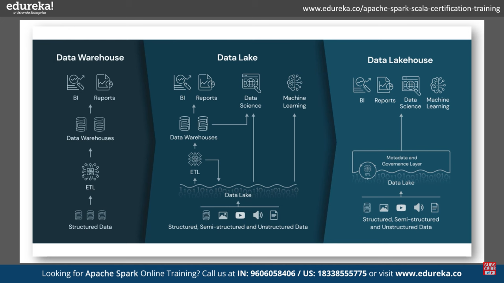
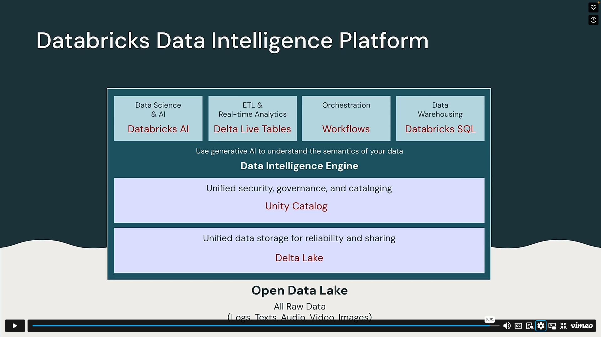
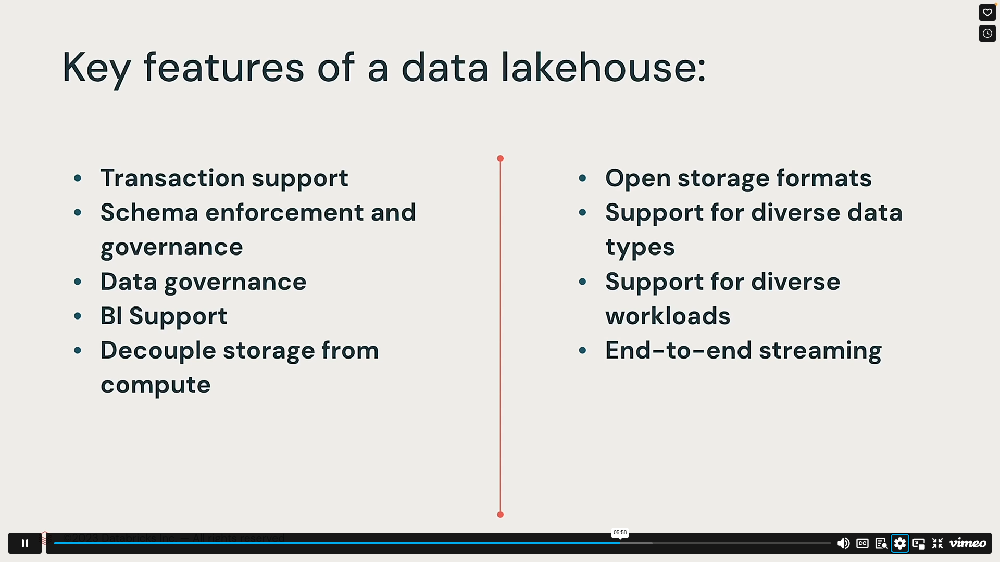
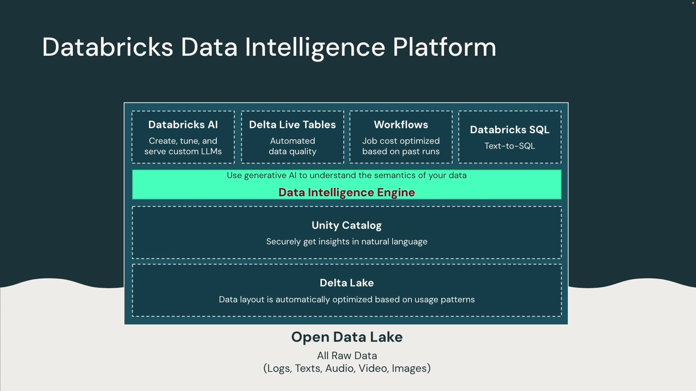
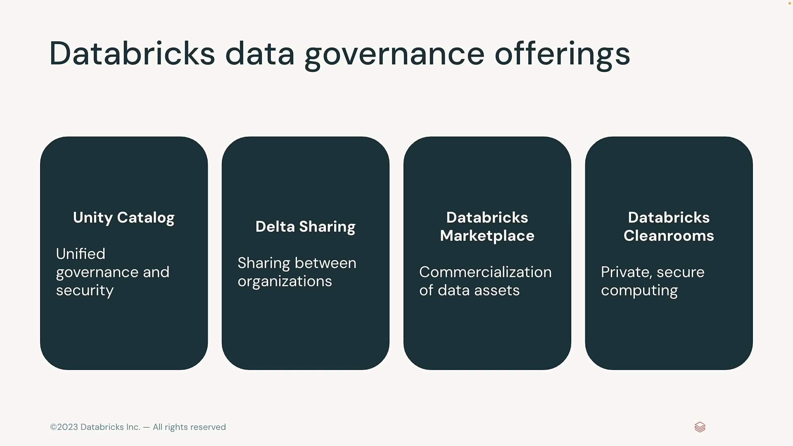

# 🔹 What is a Data Lake?

A **data lake** is a centralized storage repository that allows you to store **structured, semi-structured, and unstructured data** at any scale.

### ✅ Key Points:

- **Raw storage**: stores data _as-is_ (without enforcing schema at write-time)
- **All data types**: CSV, JSON, images, logs, video, and more

---

# 🔹 What is Data Warehousing?

A **data warehouse** is a system optimized for **querying and reporting** large volumes of **structured data**.

---

# 🖼️ Visual Diagrams

Here are some visual illustrations to help clarify the concepts:

  
  
  
  
  

---

# 📌 Summary Table

| Aspect             | Data Lake                                 | Data Warehouse                      |
| ------------------ | ----------------------------------------- | ----------------------------------- |
| **Data Type**      | Structured, semi-structured, unstructured | Structured only                     |
| **Schema**         | Schema-on-read                            | Schema-on-write                     |
| **Use Cases**      | Data science, ML, big data exploration    | BI reporting, dashboards, analytics |
| **Cost Structure** | Low-cost object storage                   | More expensive, optimized storage   |
